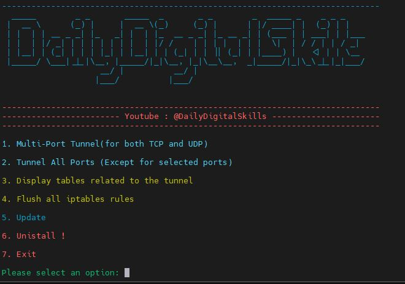

# IPTABLE Tunnel multi port
 

<br/>
<p align="center">
  <h3 align="center">IPTABLE TUNNEL (MULTI PORT)</h3>

</p>


## About The Project
<p align="center">
  <a href="https://github.com/azavaxhuman/MarzbanInboundGenerator">
    
  </a>
</p>

ساخت تانل IPTABLE در دو حالت مختلف <br>
1.مالتی پورت(فقط پورت های خاص)<br>
2. همه ی پورت ها (بجز پورت های سفارشی توسط کاربر )
<br>
________________________________
<br><br>
✅ ماندگاری تنظیمات حتی با ریبوت سرور <br>
✅ تانل ترافیک مبتنی بر پروتکل های  tcp و udp<br>
✅ قابلیت نمایش زنجیر ها و قوانین جدول NAT و بازنشانی آن ها به حالت اولیه با یک گزینه<br>


<br>

<br>

## Install & Use


<br><br>
نصب: دستور زییر رو وارد کنید ، نرم افزار اسکریپت نصب و اجرا میشه ، برای هر بار اجرای نرم افزار کافیه دستور dds-tunnel رو اجرا کنید.
<br>

<br>


```sh
git clone https://github.com/azavaxhuman/IPTABLE-Tunnel-multi-port.git /root/dds-tunnel && chmod +x /root/dds-tunnel/install.sh && /root/dds-tunnel/install.sh
```
<br>

 برای هر بار اجرای نرم افزار کافیه دستور dds-tunnel رو اجرا کنید.
<br>

<br>

```sh
dds-tunnel
```

## YouTube 

You Can find my Videos on Daily Digital Skills Channel . See [YouTube](https://www.youtube.com/@Dailydigitalskills/) for more information.
## License

Distributed under the GPL-3.0 License. See [LICENSE](https://github.com/azavaxhuman/MarzbanInboundGenerator/blob/main/LICENSE.md) for more information.

## Authors

* **AzavaxHuman** - *Daily Digital Skills* - [AzavaxHuman](https://github.com/azavaxhuman) - **

## Acknowledgements

* [Project X](https://xtls.github.io/)
* [Marzban](https://github.com/Gozargah/Marzban)
* []()

